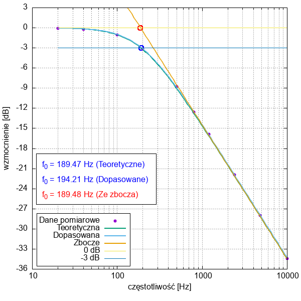
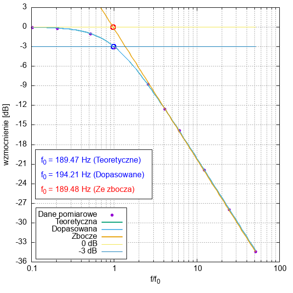
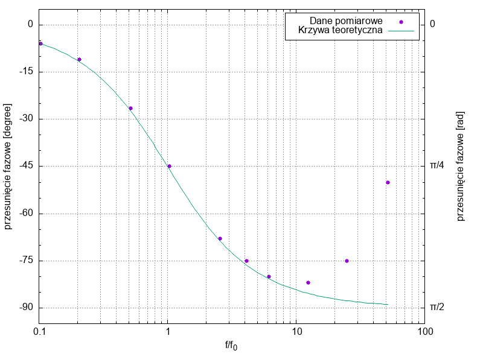

Skrypty Gnuplot do rysowania charakterystyk amplitudowo-fazowych filtrów dolno-, górno- i środkowo-przepustowych z ćwiczenia 2 Specjalistycznej Pracowni Elektronicznej Wydziału Fizyki, Astronomii i Informatyki Stosowanej UJ.

### Uruchomienie skryptów
Skrytpy nazywają się `wykres_dp.gp`, `wykres_sp.gp` i `wykres_gp.gp` gdzie `dp`, `sp` i `gp` oznacza dolno, środkowo- i górno-przepustowy.

Uruchomianie za pomocą polecenia:
```bash
gnuplot wykres_dp.gp
gnuplot wykres_sp.gp
gnuplot wykres_gp.gp
# lub wszystykie na raz w środowisku Linux
for f in wykres_?p.gp; do gnuplot $f; done
```

Aby skrypty zadziałały, należy najpierw przygotować dane.

### Przygotowanie danych
Należy przygotować pliki z danymi. Domyślne nazwy to `dane_dp.txt` dla filtru dolnoprzepustowego RC i `dane_gp.txt` dla filtru górnoprzepustowego RC.

Przykładowy plik danych `dane_dp.txt` to:

```
# f [Hz]    K           ∇φ [deg]
20          0.99        -6
40          0.975       -11
100         0.8875      -26.5
200         0.696       -45
500         0.365       -68
800         0.235       -75
1200        0.1605      -80
2400        0.08        -82
4800        0.04        -75
10000       0.019       -50
```
Pierwsza linijka zaczynająca się od `#` to komentarz.

Te dane pozwalaja wygenerować chakarkterystyki jak na obrazkach:
* Charakterystyka amplitudowa filtru dolnoprzepustowego w domenie częstotliwości

* Charakterystyka amplitudowa filtru dolnoprzepustowego w domenie relatywnej częstotliwości

* Charakterystyka fazowa filtru dolnoprzepustowego w domenie relatywnej częstotliwości
